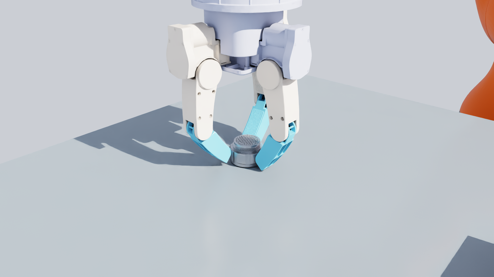
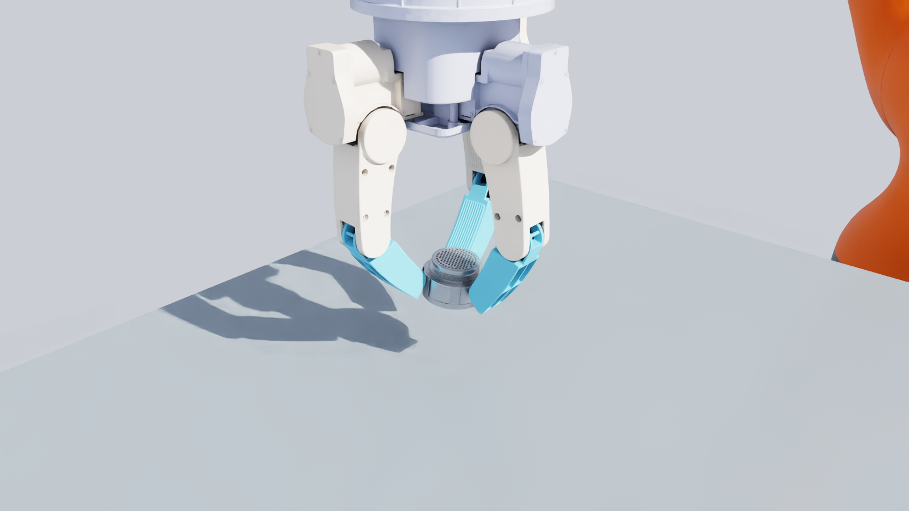
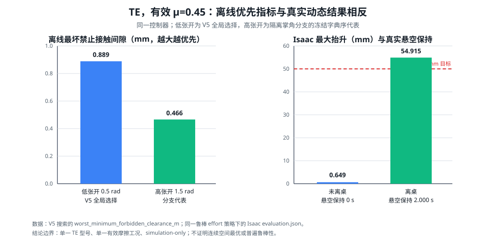
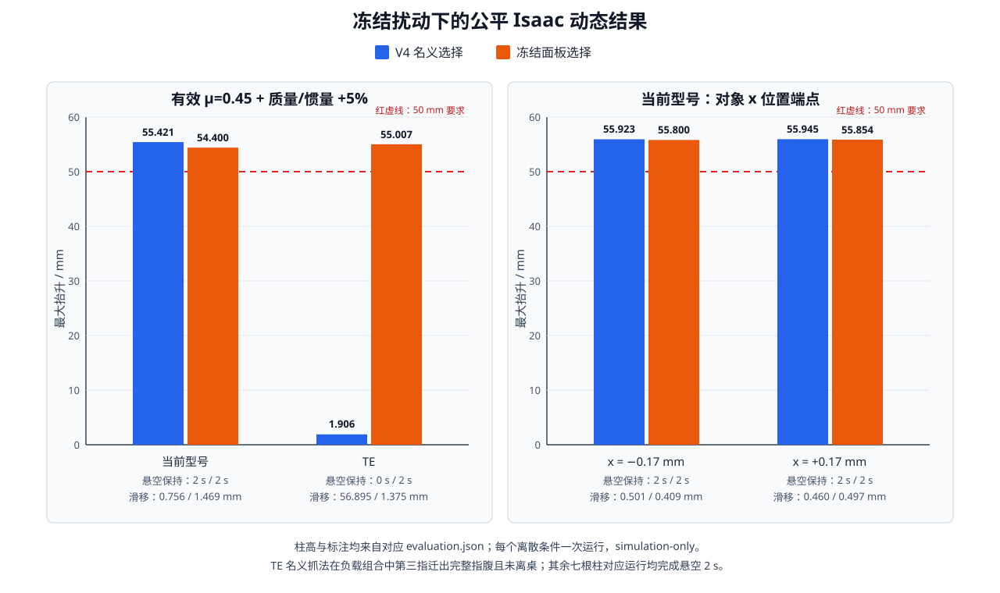

# 无指甲三指抓法：有限域最优、双型号动态对比与鲁棒性边界

## 实际结果先行

**V5 抓法在两个型号上都由三块完整蓝色无指甲指腹形成合法接触，连接器离桌、抬升超过 50 mm、保持 2 s，错误接触为 0；双型号名义动态抓取真实发生。**

准确结论是：

> 无指甲三指名义抓取在当前 D38999/26KJ61SN 和
> TE/DEUTSCH D38999/26FJ35PN 两个型号上动态成功。

| 型号，V5 抓法 | 三块完整指腹 | 离桌 | 抬升 mm | 保持 s | 滑移 mm | 姿态变化 ° | 手基座 z 有限差分加速度 m/s²（诊断） | 物理结果 |
|---|---:|---:|---:|---:|---:|---:|---:|---:|
| 当前 D38999/26KJ61SN | 是 | 是 | 55.831 | 2.000 | 0.399 | 4.772 | 0.011164 | 名义抓取成功 |
| TE D38999/26FJ35PN | 是 | 是 | 55.770 | 2.000 | 0.509 | 0.156 | 0.014645 | 名义抓取成功 |

两次运行使用相同的冻结控制器。最后一项是手基座世界 z 轨迹的有限差分；`0.020832 m/s²` 没有
已验证安全规格来源，现仅保留为诊断数据，不参与抓取、鲁棒或安全成败。
原始评价分别在：

- [当前型号 V5 名义运行](../robustness_v5_development/payload_feedforward_v2/current/nominal/grasp_run01/evaluation.json)
- [TE V5 名义运行](../robustness_v5_development/payload_feedforward_v2/te/nominal/grasp_run01/evaluation.json)

这两次名义运行的原始命令和输入路径可以恢复，但评价器当时的源码哈希没有对应 Git 提交，因而不能
保证位级复现历史 JSON。冻结后的 held-out 运行绑定到提交 `5612883`，可以恢复相同源码和配置。

结论边界：全部结果均为 **simulation-only**，不是硬件验证；TE 数据在方法开发期间已经被观察过，
所以是跨型号验证，不是严格盲测；当前结果不是连续抓取空间的绝对全局最优，也不是正式鲁棒性证书。

最新的冻结扰动结果进一步收缩了算法结论：冻结动态面板选择在两个型号各 10 个离散工况中都完成
了三指合法接触、离桌、50 mm 和悬空 2 s。当前型号的 V4 名义抓法也已在同一 10 点集合全部完成，
所以 V4 与 V5 的最坏 `R_task` 同为 1，H1 在当前型号上不受支持。TE 的 V4 名义抓法在低摩擦+
高质量工况第三指迁出指腹、未离桌，而 V5 完成，因此 TE 的最坏 `R_task` 从 0 提高到 1。
H1 是**型号依赖的混合结果**，不是双型号一致优势。

## 公平算法对比

V4 是冻结有限集合中最大化名义任务承载倍率的抓法。V5 不再追求最高名义承载倍率，而是在同一
有限集合中优先保留扰动后的禁止接触间隙，再比较最坏任务承载倍率。下表四次 Isaac 运行使用相同
控制器、对象属性和完整指腹语义，因此 V4 与 V5 的实际接触和运动可以直接比较。

| 型号与抓法 | 预测任务承载倍率 | 禁止接触余量 mm | 关节力矩余量 N·m | 指腹法向力余量 N | 抬升 mm | 保持 s | 滑移 mm | 姿态变化 ° | 手基座 z 有限差分加速度 m/s²（诊断） | 物理结果 |
|---|---:|---:|---:|---:|---:|---:|---:|---:|---:|---:|
| 当前 V4 名义最优 | 1.9678 | 0.5426 | 0.4426 | 5.4798 | 55.774 | 2.000 | 0.500 | 5.300 | 0.036026 | 名义抓取成功 |
| 当前 V5 鲁棒选择 | 1.3693 | 1.9115 | 0.2427 | 4.6427 | 55.831 | 2.000 | 0.399 | 4.772 | 0.011164 | 名义抓取成功 |
| TE V4 名义最优 | 1.8780 | 0.7510 | 0.4208 | 5.3458 | 54.644 | 2.000 | 0.590 | 0.216 | 0.059502 | 名义抓取成功 |
| TE V5 鲁棒选择 | 1.2816 | 0.9136 | 0.1977 | 4.4311 | 55.770 | 2.000 | 0.509 | 0.156 | 0.014645 | 名义抓取成功 |

四次运行都完成了三指合法接触、离桌、50 mm 和 2 s，错误接触均为 0。手基座有限差分加速度的
差异只描述轨迹形状，不能把 V4 写成安全失败或把 V5 写成安全通过；四次数据也不能单独证明更大的
几何间隙必然造成更低加速度。

原始公平评价：

- [当前 V4](../algorithm_fair_comparison_v1/v4_nominal/current/grasp_run01/evaluation.json)
- [TE V4](../algorithm_fair_comparison_v1/v4_nominal/te/grasp_run01/evaluation.json)
- [当前 V5](../robustness_v5_development/payload_feedforward_v2/current/nominal/grasp_run01/evaluation.json)
- [TE V5](../robustness_v5_development/payload_feedforward_v2/te/nominal/grasp_run01/evaluation.json)

### 历史手工 baseline 只能作描述

| 型号，历史手工抓法 | 预测任务承载倍率 | 禁止接触余量 mm | 抬升 mm | 保持 s | 滑移 mm | 姿态变化 ° | 峰值加速度 m/s² |
|---|---:|---:|---:|---:|---:|---:|---:|
| 当前 | 1.2773 | 0.8149 | 55.732 | 2.000 | 0.407 | 4.422 | 0.013233 |
| TE | 0.5552 | 0.8468 | 55.379 | 2.000 | 0.430 | 0.078 | 0.046431 |

这两次历史运行使用更早的控制器，不能与上表作控制变量齐全的因果比较。它们只证明手工名义抓法
曾真实抓起并保持，不能用于声称自动算法在所有动态指标上胜过手工抓法。

## 从搜索矛盾到可执行算法

最早的算法矛盾是：Isaac 中已经成功的抓法被旧离线入口判为碰撞。解决办法不是扩大搜索，而是把
已知成功抓法送入同一几何入口，依次对齐坐标、完整指腹碰撞、闭合路径和接触受力语义。最终规则是：

- 合法接触区域是每根**完整蓝色指腹**，不是两个三角片；
- 手—物、手—桌、手自碰和闭合路径使用完整几何；
- 一块指腹上的多个 FCL 碰撞 witness 只表示一个接触斑，不能各自获得一套独立力上限；
- 任务受力模型把每块接触斑压缩成一个合力点，不允许凭空加入独立扭转力矩；
- 动态闭合逐指达到离线所需力矩后停止，最大预紧增量仍为 0.075 rad，实测保护上限仍为 0.90 N·m。

这里没有把整块指腹缩成一个小面。几何和语义层始终使用整块指腹；只有静态受力层把已检测到的
接触斑近似为一个合力：

\[
c_i=\frac{1}{m_i}\sum_{j=1}^{m_i}c_{ij},\qquad
n_i=\frac{\sum_j n_{ij}}{\left\|\sum_j n_{ij}\right\|}.
\]

这个 witness 位置与法向的算术平均是工程建模假设，不是论文证明的软指腹等效定律；它不表示真实
压力分布、柔顺变形或接触斑扭转摩擦。

## 数学目标

对第 \(i\) 块指腹的合力点 \(c_i\)，取连接器 CAD 外法向 \(n_i\) 和两个切向基
\(t_{i1},t_{i2}\)。使用摩擦合同下界 \(\mu=0.45\) 的八边内接锥：

\[
b_{ik}=-n_i+\mu\left(\cos\phi_k\,t_{i1}+\sin\phi_k\,t_{i2}\right),
\qquad \phi_k=\frac{2\pi k}{8},
\]

\[
f_i=\sum_k\alpha_{ik}b_{ik},\qquad \alpha_{ik}\ge0.
\]

白话解释：指腹只能推连接器，不能拉；切向力必须留在摩擦允许范围内。八边锥是精确库仑圆锥的
保守多面体近似，不是精确圆锥。

以连接器质心 \(o\) 为力矩原点，每条锥边形成六维力和力矩列：

\[
w_{ik}=\begin{bmatrix}b_{ik}\\(c_i-o)\times b_{ik}\end{bmatrix}.
\]

保持和竖直抬升阶段分别求一个线性规划：

\[
\begin{aligned}
\max_{\alpha,\lambda_s}\quad &\lambda_s\\
\text{s.t.}\quad
&W\alpha=\lambda_s d_s,\\
&\alpha\ge0,\\
&\sum_k\alpha_{ik}\le8\ \mathrm{N},\quad i=1,2,3,\\
&-\tau_{\max}\le T\alpha\le\tau_{\max}.
\end{aligned}
\]

其中 \(d_s\) 由对象质量、重力和冻结抬升轨迹峰值加速度得到，\(T\) 由手指雅可比把接触力映射到
关节力矩。V4 唯一的名义主分数是：

\[
\rho_{\mathrm{nom}}(g)=
\min\{\lambda_{\mathrm{hold}},\lambda_{\mathrm{lift}}\}.
\]

没有把碰撞、滑移、姿态变化和力矩任意加权成一个总分。V4 只在 \(\rho_{\mathrm{nom}}\) 相同时，
才依次用禁止接触间隙、关节限位余量、闭合余量和固定网格顺序打破平局。

V5 对同一有限集合和离线可表达的冻结扰动集合 \(S\) 使用词典序选择：

\[
g_{V5}=\operatorname{lexmax}_{g\in G_\delta}
\left[
\min_{s\in S}c_{\mathrm{forbid}}(g,s),
\min_{s\in S}\rho(g,s),
\min_{s\in S}m_{\mathrm{joint}}(g,s),
\min_{s\in S}m_{\mathrm{closure}}(g,s)
\right].
\]

因此 V5 是“冻结场景下的鲁棒选择器”，不是 V4 的名义任务承载最优，也不是连续不确定集合上的
鲁棒最优证明。

## 冻结有限集合 \(G_\delta\)

\[
G_\delta=P_{\mathrm{palm}}\times Y_{\mathrm{yaw}}\times Z_{\mathrm{axial}}.
\]

| 维度 | 冻结定义 |
|---|---|
| 手掌关节 | 0 至 1.5 rad，步长 0.1 rad，另含 1.57 rad，共 17 点 |
| 绕连接器轴转角 | 0° 至 345°，步长 15°，共 24 点 |
| 当前型号轴向截面 | -2.000 至 30.500 mm，约 1 mm 步长并含端点，共 34 点 |
| TE 轴向截面 | -31.013 至 0 mm，约 1 mm 步长并含端点，共 33 点 |
| 横向偏移与倾角 | 均固定为 0 |

当前型号完整评价 \(17\times24\times34=13{,}872\) 个成员；TE 完整评价
\(17\times24\times33=13{,}464\) 个成员。这里的“完整”只指已冻结的轴对齐离散集合，
不覆盖连续姿态、横移、倾角或连续时间碰撞。

| 型号 | 生成不可行 | 路径/碰撞不可行 | 任务受力不可行 | 离线可执行 | 总数 |
|---|---:|---:|---:|---:|---:|
| 当前 | 2,280 | 3,456 | 264 | 7,872 | 13,872 |
| TE | 3,192 | 2,448 | 6,251 | 1,573 | 13,464 |

V4 名义最优：

| 型号 | 手掌关节 rad | 轴向转角 | CAD 轴向截面 mm | 名义承载倍率 | 禁止接触余量 mm |
|---|---:|---:|---:|---:|---:|
| 当前 | 1.50 | 195° | 4.992 | 1.9678 | 0.543 |
| TE | 1.40 | 225° | -5.135 | 1.8780 | 0.751 |

V5 鲁棒选择：

| 型号 | 手掌关节 rad | 轴向转角 | CAD 轴向截面 mm | 名义承载倍率 | 离线最坏承载倍率 | 名义禁止接触余量 mm | 离线最坏禁止接触余量 mm |
|---|---:|---:|---:|---:|---:|---:|---:|
| 当前 | 1.00 | 150° | 11.992 | 1.3693 | 1.2403 | 1.911 | 1.909 |
| TE | 0.50 | 30° | -5.135 | 1.2816 | 1.0906 | 0.914 | 0.889 |

V5 离线场景包含名义、位姿 x 正负 0.17 mm、轴向角正负 2°、摩擦 0.45/0.55、质量正负 5%、
质心 x 正负 1 mm、第三指关节目标正负 0.004 rad，以及两个预先定义的组合场景。第三指预紧比例
属于动态变量，没有进入离线选择。

## 文献怎样改变了算法

| 原始工作 | 解决的问题与核心思想 | 本工程采用、排除及原因 |
|---|---|---|
| [Ferrari & Canny, *Planning Optimal Grasps*, ICRA 1992](https://people.eecs.berkeley.edu/~jfc/papers/92/FCicra92.pdf) | 用离散接触原始力构造六维抓取力空间和力闭合质量。 | 采用六维秩与原点位于离散摩擦锥凸包内部的力闭合诊断；没有采用各向同性球半径作主分数，因为本任务明确要求保持和竖直抬升。 |
| [Borst, Fischer & Hirzinger, *How to Choose a Suitable Task Wrench Space*, ICRA 2004](https://robotic.de/fileadmin/robotic/borst/Borst-ICRA2004-TaskWrenchSpace.pdf) | 用任务真正需要抵抗的力和力矩定义质量，避免随意混合量纲。 | 直接建立保持和竖直抬升任务载荷；采用八边摩擦锥。论文也指出八边近似仍有离散误差，所以不把 LP 写成精确圆锥结论。 |
| [Fakhari et al., *Computing a Task-Dependent Grasp Metric Using Second-Order Cone Programs*, IROS 2021](https://doi.org/10.1109/IROS51168.2021.9636197) | 联合任务方向、摩擦、逐接触力上限、重力和关节力矩约束。 | 采用任务承载倍率、逐指力上限和雅可比力矩约束；因为本工程已经用八边锥线性化，只用一个 LP，没有为了形式复杂再叠加 SOCP。 |
| [Zheng, *Computing the Best Grasp in a Discrete Point Set*, Autonomous Robots 2019](https://doi.org/10.1007/s10514-018-9788-4) | 区分离散点集最佳与连续空间最佳，并在离散集合中评价 wrench 能力。 | 冻结 \(G_\delta\) 后逐项穷举。没有采用论文的支撑函数剪枝；启发式不删除成员，所以只声称冻结有限域内最佳。 |
| [Zheng & Qian, *Coping with the Grasping Uncertainties in Force-Closure Analysis*, IJRR 2005](https://doi.org/10.1177/0278364905049469) | 定量研究摩擦衰减与接触位置误差怎样破坏力闭合。 | 用它确定要显式检查摩擦和接触位置余量；没有实现论文的连续接触位置鲁棒半径，因此不能声称连续鲁棒性证书。 |
| [Liu & Carpin, *Global Grasp Planning Using Triangular Meshes*, ICRA 2015](https://robotics.ucmerced.edu/sites/robotics.ucmerced.edu/files/page/documents/graspingicra2015.pdf) | 直接在 CAD 常用三角网格上生成接触点，并允许跨网格边移动。 | 采用“真实 CAD 网格是几何输入”的原则；没有采用其迭代优化，因为当前研究需要对预先冻结的有限域作完整评价，而迭代结果不能提供该完整性结论。 |
| [Charusta et al., *Independent Contact Regions Based on a Patch Contact Model*, ICRA 2012](https://doi.org/10.1109/ICRA.2012.6225325) | 把可容纳接触变化的指腹视为有限接触区域。 | 支持整块蓝色指腹语义；不支持 FCL witness 算术平均等价于真实软接触，该规则仍只标为工程假设。 |

## 真实图和机器可读数据

- [CAD、三指接触点、法向与八边摩擦约束](cad_contacts_normals_friction.png)
- [有限集合状态和可执行候选质量分布](gdelta_search_and_quality_distribution.png)
- [历史 baseline 与 V4 的描述性对比](baseline_vs_finite_best.png)
- [V4 与 V5 同控制器公平动态对比](v4_nominal_vs_v5_robust_fair.png)
- [两个型号 V4 自动抓法的真实 Isaac 最终保持帧](isaac_two_model_final_hold.png)
- [历史 baseline/V4 数值](comparison.csv)
- [V4/V5 公平数值](v4_vs_v5_fair_comparison.csv)
- [冻结扰动下 H1 的真实动态对比](frozen_h1_physical_comparison.svg)
- [CAD/FCL 接触 witness](contact_witnesses.csv)
- [机器可读摘要](summary.json)

接触图中的点和法向是 CAD/FCL 预测，不是 Isaac 实测接触坐标；半透明网格只为显示，搜索和碰撞
使用完整 CAD。最终保持图是两次真实 V4 Isaac 运行的保存帧，标题数值绑定各自图像运行；公平对比表
使用后来在冻结共同控制器下重跑的 V4 数值，所以不能把图像标题数值替换为公平重跑数值。

## 冻结后鲁棒性：协议开发数据与修正后的失败边界

冻结研究边界是：对象 x 位置 ±0.17 mm、轴向角 ±2°、摩擦系数 0.45 至 0.55、质量 ±5%、
质心 x ±1 mm、第三指关节目标 ±0.004 rad、第三指预紧比例 ±5%。除摩擦区间来自共享仿真材料
合同外，其余都是明确标注的研究假设，不是硬件标定误差。

旧运行按单变量顺序执行，物理轨迹和原始 JSON 均保留。但它们使用的协议把手基座有限差分加速度
误作硬门，且摩擦扰动没有证明接触对的有效摩擦等于请求值。因此下表只能称为协议开发数据，不能
据此宣布正式鲁棒通过或失败。

| 型号与旧场景 | 抬升 mm | 保持 s | 滑移 mm | 姿态变化 ° | 手基座 z 有限差分加速度 m/s²（诊断） | 证据边界 |
|---|---:|---:|---:|---:|---:|---:|
| 当前，名义 | 55.831 | 2.000 | 0.399 | 4.772 | 0.011164 | 名义里程碑；诊断量不作硬门 |
| TE，名义 | 55.770 | 2.000 | 0.509 | 0.156 | 0.014645 | 名义里程碑；诊断量不作硬门 |
| 当前，x = -0.12 mm | 55.835 | 2.000 | 0.441 | 4.369 | 0.012746 | 协议开发 |
| TE，x = -0.12 mm | 55.784 | 2.000 | 0.541 | 0.127 | 0.018665 | 协议开发 |
| 当前，轴向角 = +0.75° | 55.849 | 2.000 | 0.441 | 4.255 | 0.012711 | 协议开发 |
| TE，轴向角 = +0.75° | 55.788 | 2.000 | 0.532 | 0.118 | 0.020053 | 协议开发 |
| 当前，请求摩擦系数 = 0.49 | 55.306 | 2.000 | 0.694 | 5.418 | 0.024180 | 有效摩擦未证明；协议开发 |

旧摩擦 0.49 运行被原样重复一次，关键数值和时序一致；数据不删除，但“加速度越界导致安全失败”
的旧结论撤销。它只证明该旧材料协议下连接器曾离桌、达到 55.306 mm 并保持 2 s。

原始冻结后评价：

- [当前 x = -0.12 mm](../robustness_v5_final_validation_v2/v5/current/heldout_pose_x_minus_0p12mm/grasp_run01/evaluation.json)
- [TE x = -0.12 mm](../robustness_v5_final_validation_v2/v5/te/heldout_pose_x_minus_0p12mm/grasp_run01/evaluation.json)
- [当前 yaw = +0.75°](../robustness_v5_final_validation_v2/v5/current/heldout_yaw_plus_0p75deg/grasp_run01/evaluation.json)
- [TE yaw = +0.75°](../robustness_v5_final_validation_v2/v5/te/heldout_yaw_plus_0p75deg/grasp_run01/evaluation.json)
- [当前 μ = 0.49，第一次](../robustness_v5_final_validation_v2/v5/current/heldout_friction_0p49/grasp_run01/evaluation.json)
- [当前 μ = 0.49，精确重复](../robustness_v5_final_validation_v2/v5/current/heldout_friction_0p49/grasp_run02/evaluation.json)

修正协议后，runner 同时设置并读回整块指腹与连接器实际碰撞面的静、动摩擦，并在双方使用
`max` 合并。请求 0.45 时，两侧与最终有效静、动摩擦均为 0.449999988。控制器和其他条件未改。

| 型号与抓法，有效 μ=0.45 | 完整指腹接触是否保持 | 离桌 | 最大抬升 mm | 有效悬空保持 s | 滑移 mm | 最早失败阶段 |
|---|---:|---:|---:|---:|---:|---|
| 当前，V5 鲁棒选择 | 是 | 是 | 54.855 | 2.000 | 0.826 | 无 |
| TE，V5 鲁棒选择 | 否；第一指在抬升阶段出现非指腹面接触 | 否 | 0.649 | 0 | 56.618 | 抬升 |
| TE，V4 名义选择 | 否；第三指在抬升阶段出现非指腹面接触 | 否 | 1.963 | 0 | 56.984 | 抬升 |
| TE，静态最小摩擦并列抓法，轴向方位 45° | 是，直至安全中止 | 否 | 1.441 | 0 | 7.176 | 抬升；第一指 effort 超限 |
| TE，冻结动态面板高张开代表，V5 鲁棒 effort | 是 | 是 | 54.915 | 2.000 | 1.661 | 无 |

当前型号通过所有保留的真实硬门。TE 的 V5 和 V4 都先形成三根末端手指接触，但连接器始终没有
释放桌面接触；接触点分别在仿真时刻 20.1875 s 和 20.145833 s 越过完整指腹边界。V4 的最大姿态
变化为 6.797°。两份评价中的 `hold_duration_s=2` 都只是控制阶段持续时间，不是悬空保持。按冻结
停止条件，后续扰动没有启动，控制器没有调整。

修正协议原始评价：

- [当前，有效 μ=0.45](../robustness_protocol_v3_effective_friction/current/friction_lower_0p45/grasp_run01/evaluation.json)
- [TE V5 鲁棒选择，有效 μ=0.45](../robustness_protocol_v3_effective_friction/te/friction_lower_0p45/grasp_run01/evaluation.json)
- [TE V4 名义选择，有效 μ=0.45 及最终诊断](../robustness_protocol_v3_effective_friction/te_v4_nominal_candidate/friction_lower_0p45/grasp_run04/evaluation.json)
- [TE 静态最小摩擦并列抓法、轴向方位 45°，有效 μ=0.45](../robustness_protocol_v3_effective_friction/te_friction_margin_yaw45/friction_lower_0p45/grasp_run01/evaluation.json)
- [当前，带抬升转换快照的有效 μ=0.45 成功重放](../dynamic_predictor_probe_v1/current_mu0p45/grasp_run02/evaluation.json)
- [TE V5，带抬升转换快照的有效 μ=0.45 失败重放](../dynamic_predictor_probe_v1/te_mu0p45/grasp_run01/evaluation.json)
- [TE V5，预注册有效 μ=0.55 的 `M_1` 反例](../dynamic_predictor_probe_v1/te_mu0p55/grasp_run01/evaluation.json)
- [TE 冻结动态面板高张开代表，有效 μ=0.45、V5 鲁棒 effort](../dynamic_candidate_panel_v1/te_p15_y20_z25_robust_effort_mu0p45/grasp_run01/evaluation.json)

### 低摩擦失败对当前研究假设的判别

当前可反驳假设是：同一有限候选集合与冻结控制器下，按冻结扰动中最坏物理余量选择的抓法，是否
比名义任务承载最优抓法具有更大的 Isaac 动态失效边界。有效 μ=0.45 是其中一个明确离散条件；TE
的 V4 与 V5 都在该条件下未离桌。因此这个边界数据**不支持** V5 优于 V4。它不证明所有
\(G_\delta\) 候选失败，也不证明该假设在其他扰动、其他型号或连续空间中普遍为假。

为区分失败机理，在不改控制器和物理条件的同一运行中记录了抬升转换点：

| TE V4 抬升前观测 | 第一指 | 第二指 | 第三指 |
|---|---:|---:|---:|
| 实测 closing effort N·m | 0.503736 | 0.484127 | 0.491585 |
| 按预测接触计算的所需 effort N·m | 0.477955 | 0.479226 | 0.479226 |
| 指腹相对非指腹边界的有符号余量 mm | 1.106 | 1.890 | 1.574 |

三指当时均已接触，原配置所需 effort 均已达到，且接触点不是贴着边界开始抬升；第一抬升步的边界
余量只变化约千分之一毫米。第三指是在随后约 5.35 s 内沿指腹移动约 9.2 mm 后才跨界。因此数据
分别否定“只是 V5 第二指目标 effort 太高”和“V4 一开始就在指腹边缘”这两个单因解释。

将同一时刻 Isaac 实测的三个对象接触点、法向和关节位姿重新代入现有静态任务 LP，得到承载倍率
1.795，逐指所需 effort 为 `[0.501346, 0.405764, 0.501346] N·m`。实测值相对它们为
`[+0.002390, +0.078362, -0.009761] N·m`。这构成直接反例：静态 LP 能证明某种承载力分配存在，
但冻结控制器没有完整实现该分配，且对象载荷没有从桌面转移到手。第三指差额是当前第一个明确的
模型—执行矛盾；单次数据仍不足以断言它是唯一失效原因。

这也限定了下一步可采用的论文机理：

- [Get a Grip](https://proceedings.mlr.press/v270/lum25b.html) 用真实动态正负样本训练多指抓取评价，
  说明接触形成和执行结果可以成为候选信息；本项目不复制其大规模学习系统，只采用“动态执行必须
  进入验证标签”的最小原则。
- [Grasp to Act](https://arxiv.org/html/2602.20466) 在 Isaac 中对候选做动态施扰评分，也直接覆盖
  静态抓取力空间遗漏的执行失效；其专用强化学习控制器不进入本轮固定控制器对比。
- [SpringGrasp](https://www.roboticsproceedings.org/rss20/p042.html) 通过柔顺预抓与预计平衡接触处理
  接触建立，但其控制律就是方法的一部分，采用它会改变本轮唯一冻结变量，故不实施。
- [PONG](https://arxiv.org/abs/2309.16930) 的接触法向不确定性与当前静态 LP 都以给定接触为前提，
  不能单独预测本次闭合—抬升过程中的接触迁移。

因此现阶段不是继续扩充静态搜索或声称新算法，而是把“冻结控制器下是否维持合法接触并完成载荷
转移”作为下一候选评价必须回答的物理量。相同 μ=0.45 工况的重复诊断到此停止。

为直接检验名义承载倍率是否遗漏低摩擦余量，现有入口随后在不改变 \(G_\delta\)、碰撞、运动学、
力矩上限和控制器的条件下，对每个原可执行成员计算冻结摩擦网格

\[
\mu_{\min}^{\delta}(g)=\min\{\mu\in\{0,0.005,\ldots,0.45\}:\rho(g;\mu)\ge1\}.
\]

TE 的 13,464 个成员全部评价后，最小值为 0.285，共有 16 个并列成员；它们位于同一掌角、两个
相邻轴向截面及每隔 45° 的方位。按原名义承载倍率打破平局后，选出的仍是已在 Isaac 失败的 V4
225° 抓法；该抓法的连续 LP 阈值约为 0.2835。完整搜索结果仍保留在本地，但 18 MB 的
`search_result.json` 不进入精简 Git 里程碑；下方 `friction_margin` 命令可从冻结输入重新生成它。
因此 \(\mu_{\min}^{\delta}\) 是给定接触下的静态诊断，不能单独预测接触形成、保持或瞬态 effort。

为判断动态失败是否只是 225° 方位特例，只重放了同一掌角、同一轴向截面、相同
\(\mu_{\min}^{\delta}=0.285\) 的 45° 成员；唯一主要变量是相对 V4 绕连接器轴旋转 180°。实验前
预测是：若它完成离桌与保持，动态执行信息可作为 16 个静态并列成员的打破平局量；若它仍在抬升
阶段失败，则停止方位路线，不再试其余成员。

实际结果属于后者：三块完整指腹先合法接触且没有错误接触，抬升前实测 effort
`[0.502831, 0.504989, 0.508148] N·m` 均达到预测需求
`[0.478331, 0.479620, 0.479620] N·m`；但连接器未离桌，最大只上升 1.441 mm。进入抬升约
5.3 s 后，第一指去零 effort 峰值达到 1.093 N·m，超过冻结的 0.90 N·m 安全上限，控制器中止，
悬空保持为 0 s。有效静、动摩擦读回为 0.449999988，最大关节速度 1.299 rad/s，最大穿透
0.00031 mm，所有信号有限。故“换一个静态同分方位即可通过”被否定，剩余方位不再运行。

这个反例具体支持 Get a Grip 与 Grasp to Act 所采用的动态执行/接触形成评价机理：静态 LP 证明
的是存在一种力分配，不能保证冻结控制器沿真实轨迹实现它。它不证明学习式评分是唯一方案，也不
证明 16 个成员在任何控制器下都会失败；本项目只据此收缩结论，不声称新方法或普遍规律。

### 现有轨迹能否给出前瞻动态预测

为取得相同事件时刻的成功/失败数据，只重放了已知 current 成功与 TE V5 失败工况；控制器、候选、
有效 μ=0.45 和安全门不变。current 再次三指合法接触、离桌、抬升 54.855 mm、悬空保持 2 s，
滑移 0.826 mm；TE V5 再次在抬升阶段由第一指迁出完整指腹，未离桌，最大抬升 0.649 mm、悬空
保持 0 s。首次 current 重放在仿真结束后的评价阶段因对象质量字段读取错误没有生成评价；唯一代码
修正是从正式对象模型读取同一质量，随后立即回到上述物理实验，没有修改任何物理或控制参数。

先检验最小、不加权的载荷转移诊断量：

\[
U_\uparrow=\sum_i N_i\left(|n_{iz}|+\mu\sqrt{1-n_{iz}^2}\right),\qquad
R=U_\uparrow/F_{\rm table}.
\]

\(U_\uparrow\) 是按每指法向载荷与摩擦锥得到的乐观向上承载上界，\(F_{\rm table}\) 是同一时刻桌面
支持力。最后预抬升与首个抬升步的同构结果为：

| 运行 | 真实结果 | 预抬升 \(R\) | 首步 \(R\) | predicted effort 是否三指达到 |
|---|---|---:|---:|---:|
| 当前 V5，μ=0.45 | 离桌、54.855 mm、悬空 2 s | 0.253 | 0.257 | 否；第二指低 0.107 N·m |
| TE V5，μ=0.45 | 未离桌、0.649 mm，第一指迁出指腹 | 0.808 | 1.355 | 否；第二指低 0.198 N·m |
| TE V4，μ=0.45 | 未离桌、1.963 mm，第三指迁出指腹 | 1.104 | 0.967 | 是 |
| TE 45°，μ=0.45 | 未离桌、1.441 mm，第一指 effort 中止 | 0.737 | 0.762 | 是 |

成功运行低于 1，失败运行又同时位于 1 的两侧，因此“\(R>1\) 才能开始成功卸载桌面”被直接否定。
predicted-effort 门同样既非必要也非充分：current 未全部达到却成功，V4 与 45° 全部达到却失败。
两者都不能作为下一候选评分。

随后只检验一个与完整指腹直接对应的早期动态量：

\[
M_1(g)=\max_i\frac{\lVert c_i(t_1)-c_i(t_0)\rVert_2}{d_i(t_0)},
\qquad t_1-t_0=1/240\ {\rm s}.
\]

\(c_i\) 是第 \(i\) 指接触质心，\(d_i\) 是该接触在最后预抬升时离完整指腹/非指腹边界的有符号
余量。该比值回答“抬升的第一个物理步已经消耗了多少剩余指腹区域”：

| 运行 | 首步最大接触质心位移 | 对应 \(M_1\) | 结果 |
|---|---:|---:|---|
| 当前 V5 | 1.027 μm | 0.000530 | 成功 |
| TE V5 | 6.247 μm | 0.003980 | 接触迁移失败 |
| TE V4 | 2.681 μm | 0.002425 | 接触迁移失败 |
| TE 45° | 22.161 μm | 0.013663 | effort 中止 |

当前一次成功低于三次失败，支持“初始接触迁移相对边界余量越大，冻结控制器后续越容易迁出指腹或
累积 effort”的可反驳假设。但这是用已观察样本得到的探索性分离，不是阈值证书、因果证明或独立
验证，尚不能直接加入 \(G_\delta\) 的最终评分。

SpringGrasp 说明实现接触力取决于控制状态与接触位移；Get a Grip 和 Grasp to Act 把动态执行结果
纳入候选评价。它们对本项目的具体改变仅是：将一个极短的闭合—抬升动态接触迁移检查作为待验证
候选量，而不是修改冻结控制器或复制论文的学习框架。按 TE 真实失败后的停止条件，本轮不再运行；
下一次必须先冻结 \(M_1\) 定义和独立验证工况，失败时直接否定，不能看结果后再改公式或阈值。

#### `M_1` 单变量反驳实验预注册

待验证的单一假设是：TE V5 在 μ=0.45 下的抬升失败由摩擦敏感的早期接触迁移触发，首个物理步
消耗的指腹边界余量可以前瞻区分这一次成功或失败。只把接触对有效静、动摩擦从 0.45 改为冻结扰动
集合中的 0.55；指腹和连接器两侧材料、`max` 合并规则与有效值都必须读回为 0.55。候选、控制器、
手位姿、对象属性、时间步和安全门不变。

在运行前冻结 \(B_0=0.00242527\)，即提出指标时三个已观察失败中的最小 \(M_1\)。预测为：三块
完整指腹持续接触、连接器离桌、抬升至少 50 mm、有效悬空保持至少 2 s，且 \(M_1<B_0\)。任一
物理条件失败，或 \(M_1\ge B_0\)，均否定该简单预测；不允许事后改公式、阈值或控制器。只有物理
成功且 \(M_1<B_0\) 才构成受控条件下的初步支持；它仍不是独立阈值认证、因果证明或跨型号泛化。

实际结果为反例。接触对两侧静、动摩擦均读回 0.5500000119，使用 `max` 合并；预抬升时三块完整
指腹均已接触且没有错误机器人/桌面/夹具接触，但第一指在仿真时间 20.408 s 的抬升阶段迁出完整
指腹。对象始终未离桌，最大抬升 1.423 mm，实际悬空保持 0 s，滑移 56.643 mm，姿态变化
5.197°。控制器走完的 2 s hold 阶段发生在对象仍受桌面支撑时，不能作为物理保持。信号有限，最大
关节速度 1.382 rad/s、最大手指 effort 0.724 N·m、最大后稳定穿透 0.000846 mm；最早失败是
指腹接触迁移，而不是这些安全门。

首步三指接触质心位移为 1.396、1.143、1.821 μm，对应归一化值 0.000883、0.000612、
0.001103，故 \(M_1=0.001103<B_0\)，但后续仍失败。这直接否定“首个 1/240 s 的低 \(M_1\)
足以预测成功”，该量不能按原定义进入候选评分，也不能事后移动阈值挽救。相对 μ=0.45 的同一抓法，
μ=0.55 把首次非指腹接触推迟约 0.221 s、最大抬升由 0.649 mm 提到 1.423 mm，却没有使对象离桌；
单次配对只说明这次响应，不能证明摩擦的普遍单调作用。

SpringGrasp 所强调的实现接触力随控制状态和接触位移演化，与本反例一致；Get a Grip 和 Grasp to
Act 的动态执行评价也说明不能把一个首步快照当作完整抓取结果。它们现在对本项目形成的具体约束是：
若以后继续动态候选评价，必须预先冻结一个覆盖载荷转移过程的有限时间域，而不是扩大静态评分或调整
控制器。本次真实失败后已停止 Isaac，未追加工况。

#### 完整执行保持量及其边界

首步代理被反例否定后，直接按冻结控制时域定义：

\[
S_{\rm ret}(g,u)=\frac{\min\{t_{\rm first\ hard\ failure}-t_{\rm lift\ start},\,T_{\rm req}\}}
{T_{\rm req}},\qquad T_{\rm req}=T_{\rm lift}+T_{\rm hold}=19+2=21\ {\rm s}.
\]

第一项硬失败沿用现有物理合同，包括完整指腹失效和 effort 安全中止；完成全部抬升与保持的运行取
1。该定义不引入新的位移、转角或时间阈值。已有原始评价给出：

| 运行 | 第一项硬失败前保持时间 | \(S_{\rm ret}\) | 实际结果 |
|---|---:|---:|---|
| current V5，μ=0.45 | 完整 21.000 s | 1.0000 | 离桌、54.855 mm、悬空 2 s |
| TE 高张开代表，μ=0.45、V5 鲁棒 effort | 完整 21.000 s | 1.0000 | 离桌、54.915 mm、悬空 2 s |
| TE V5，μ=0.45 | 5.346 s | 0.2546 | 第一指迁出指腹，未离桌 |
| TE V5，μ=0.55 | 5.567 s | 0.2651 | 第一指迁出指腹，未离桌 |
| TE V4，μ=0.45 | 5.346 s | 0.2546 | 第三指迁出指腹，未离桌 |
| TE 45°，μ=0.45 | 5.283 s | 0.2516 | effort 越界，未离桌 |

这个量复用了 [Grasp to Act](https://arxiv.org/html/2602.20466#S3.SS2.SSS2) 的明确机理：用达到
滑移/失稳条件前的持续时间评价动态抓法。但本项目不采用其人类示范、12 轴施扰、PPO 或在线关节
修正。\(S_{\rm ret}\) 是 Isaac rollout 后的结果标签，不是 CAD/静态 LP 的前瞻预测；它也不能单独
处理“全过程不越界但始终未离桌”的失败。因此它只能作为未来动态评价的一项物理量，不能在未运行
候选时自动产生抓法，更不能支持尚未完成的 \(G_\delta\) 内最优声明。

没有把文献搜索扩成新框架。[SpringGrasp](https://arxiv.org/html/2404.13532) 的解析过程指标依赖
其虚拟弹簧/阻抗，并明确把未建模重力列为重物失败限制；[Manipulation with Shared Grasping]
(https://www.roboticsproceedings.org/rss16/p086.html) 会枚举粘着/滑动接触模式，但正式方法限定为
带库仑摩擦的平面刚体；[contact-implicit MPC](https://arxiv.org/html/2402.18897) 则同时引入平滑
准动态模型、接触规划和触觉反馈控制。三者都不能在保留当前冻结控制器和三维接触合同的前提下，作为
现有静态 LP 的一个小权重补丁。当前数据支持的最小结论仍是：要评价本次失败，必须保留完整动态
过程；尚无经过 Isaac 反驳的静态代理可以替代它。

#### 隔离高张开分支的单次动态反例

没有扩大 (G_\delta) 或增加候选。只读原 V5 完整结果后，TE 的 524 个
`ROBUST_EXECUTABLE_OFFLINE` 成员只落在掌角 0.4、0.5、1.5 rad，数量分别为 310、208、6。
0.4 与 0.5 是相邻低张开族；1.5 是隔离高张开分支。每个掌角按原冻结字典序取代表时分别得到：

| 掌角 | 代表 | 最坏禁止接触间隙 mm | 最坏任务承载倍率 | 最坏关节余量 rad | 最坏闭合余量 rad |
|---:|---|---:|---:|---:|---:|
| 0.4 | 30°，z = −6.135 mm | 0.448 | 1.0551 | 0.400 | 0.2309 |
| 0.5 | 30°，z = −5.135 mm；原 V5 全局选择 | 0.889 | 1.0906 | 0.4597 | 0.2298 |
| 1.5 | 300°，z = −6.135 mm；本次动态代表 | 0.466 | 1.0946 | 0.070 | 0.2343 |

这不是第三种已证明的新接触理论：1.5 rad 相对已运行 V4 的 1.4 rad 掌形只使三条接触中心间距
改变约 0.12–0.63 mm。实验前的窄假设是：若 V5 鲁棒硬约束确实从已失败的高张开邻域保留了一个
可执行成员，那么在控制器、对象、时间步、安全门和有效 μ=0.45 都不变时，分支代表应维持三块
完整指腹、离桌、抬升至少 50 mm 并悬空保持 2 s；任一条件失败就停止候选重排。

第一次普通 replay 虽然完成了相同物理动作，但写入的是名义 effort
`[0.640094, 0.658652, 0.658652] N·m`，不能与使用 V5 鲁棒 effort 的低张开抓法公平比较。
replay 随后只改为读取该成员原 V5 已计算的逐指最坏场景 effort
`[0.822216, 0.691585, 0.774389] N·m`；控制律、安全门、几何和 μ 均未改变。公平直接运行仍支持
窄假设：三块完整指腹全程合法接触，连接器离桌，最大抬升 54.915 mm，悬空保持 2.000 s；错误
手—物、手—桌、手—夹具和未分类接触均为 0。最大滑移 1.661 mm，姿态变化 6.648°，最大手指
effort 0.732 N·m，最大关节速度 1.575 rad/s，最大后稳定穿透 0.000101 mm，没有物理失败阶段。
双方材料与 `max` 合并后的有效静、动摩擦均为 0.449999988。第一次名义-effort 运行原样保留为
协议开发数据，不承担算法公平比较结论。







该结果反驳的是原 V5 的首要排序量，不是力闭合本身：低张开全局选择的最坏禁止接触间隙更大
（0.889 mm），却在同工况未离桌；高张开代表的间隙更小（0.466 mm），却完成完整动作。因此
“先最大化离线最坏禁止接触间隙”不能充当冻结控制器下的动态最优准则。按 [Grasp to Act]
(https://arxiv.org/html/2602.20466#S3.SS2.SSS2) 的稳定时间机理，本次高张开代表的
\(S_{\rm ret}=1\)，而低张开全局选择为 0.2546；这说明完整动态 rollout 能区分二者，但仍只是
运行后的标签。

证据边界必须保留：候选来自已观察过的 TE 数据，只能算算法开发；本次是单一型号、单一摩擦工况、
simulation-only。它不证明高张开普遍更好，不证明 524 个候选的动态全局最优，也不证明连续空间
最优或完整鲁棒性。

### 冻结扰动面板与名义抓法的公平物理对照

本轮预注册问题是：在相同手、控制器和有限扰动集合下，按最坏物理余量选择的抓法是否比名义任务
承载最优抓法具有更大的实测失效边界。评价量保持为

\[
R_{\rm task}(g,u)=I_{\rm safety}I_{\rm pad}I_{\rm release}
\min\left(1,\frac{h_{\max}}{0.05},\frac{t_{\rm suspended}}{2}\right),
\qquad
g^*=\arg\max_{g\in G_\delta}\min_{u\in U_\delta}R_{\rm task}(g,u).
\]

这里的三个指示量分别要求原有安全门、三块完整指腹和真正离桌；保持时间只累计离桌后的悬空时间。
冻结动态面板在每个型号上各运行 10 个离散点：x 位置 ±0.17 mm、轴向角 ±2°、质心 x ±1 mm、
质量 +5%、第三指目标 −0.004 rad、x +0.17 mm 与第三指延迟的组合，以及有效 μ=0.45 与质量 +5%
的组合。两个型号的面板选择在 20 次单次运行中均维持三块完整指腹、离桌、抬升超过 50 mm、悬空
2 s，错误接触为 0；这只证明这些离散点的一次 simulation-only 结果，不是连续边界或统计结论。

负载侧最窄点是有效 μ=0.45 与质量/惯量 +5% 的组合。指腹和连接器碰撞面两侧静、动摩擦均读回
0.449999988，组合规则为 `max`，计算后的有效静、动摩擦仍为 0.449999988。公平结果为：

| 型号与选择 | 三块完整指腹保持 | 离桌 | 抬升 mm | 悬空保持 s | 滑移 mm | 姿态变化 ° | 最大手指 effort N·m | 后稳定穿透 mm | 最早失败 |
|---|---:|---:|---:|---:|---:|---:|---:|---:|---|
| 当前，V4 名义 | 是 | 是 | 55.421 | 2.000 | 0.756 | 0.631 | 0.486 | 0.000256 | 无 |
| 当前，冻结面板选择 | 是 | 是 | 54.400 | 2.000 | 1.469 | 5.429 | 0.705 | 0.000166 | 无 |
| TE，V4 名义 | 否；第三指迁出完整指腹 | 否 | 1.906 | 0 | 56.895 | 6.632 | 0.531 | 0.001159 | 抬升，20.275 s |
| TE，冻结面板选择 | 是 | 是 | 55.007 | 2.000 | 1.375 | 4.954 | 0.737 | 0.000176 | 无 |

TE 名义抓法在预抬升和首个抬升快照仍是三块完整指腹，随后第三指在仿真时刻 20.275 s 的抬升阶段
迁出指腹；对象没有释放桌面，因而控制程序经历 2 s hold 阶段也不能写成悬空保持。TE 的这一离散点
支持 H1。当前型号两种抓法都完成任务，而且名义抓法抬得更高、滑移和姿态变化更小，所以同一点不
支持 H1。

为直接检验 V5 更大离线禁碰余量是否会在当前型号的位姿端点转化为动态优势，又只运行了 V4 名义
抓法此前缺失的 x=±0.17 mm 两端；控制器、对象属性、材料和安全门不变：

| 当前型号 x 位移 | 选择 | 三块完整指腹/离桌/2 s | 抬升 mm | 滑移 mm | 姿态变化 ° | 最大手指 effort N·m | 后稳定穿透 mm |
|---|---|---:|---:|---:|---:|---:|---:|
| −0.17 mm | V4 名义 | 是 | 55.923 | 0.501 | 5.479 | 0.469 | 0.000181 |
| −0.17 mm | 冻结面板选择 | 是 | 55.800 | 0.409 | 4.180 | 0.630 | 0.000300 |
| +0.17 mm | V4 名义 | 是 | 55.945 | 0.460 | 5.162 | 0.547 | 0.000241 |
| +0.17 mm | 冻结面板选择 | 是 | 55.854 | 0.497 | 4.426 | 0.618 | 0.000256 |

两端都没有真实失败，因此“更大离线禁碰余量会在这两个位置端点产生更大动态成功范围”的预测被
否定，位姿端点路线停止。保持全部条件冻结后，V4 当前型号的其余成员也逐项完成；下面每格为
“最大抬升 mm / 最大滑移 mm”，两种抓法在全部格子均为三块完整指腹、离桌、悬空 2 s、错误接触 0：

| 当前型号冻结工况 | V4 名义 | V5 面板选择 |
|---|---:|---:|
| x = −0.17 mm | 55.923 / 0.501 | 55.800 / 0.409 |
| x = +0.17 mm | 55.945 / 0.460 | 55.854 / 0.497 |
| 轴向角 −2° | 55.966 / 0.429 | 55.836 / 0.428 |
| 轴向角 +2° | 55.780 / 0.723 | 55.756 / 0.357 |
| 质心 x = −1 mm | 55.946 / 0.467 | 55.828 / 0.472 |
| 质心 x = +1 mm | 55.984 / 0.482 | 55.853 / 0.470 |
| 质量/惯量 +5% | 55.853 / 0.427 | 55.856 / 0.448 |
| 第三指目标 −0.004 rad | 55.878 / 0.424 | 55.789 / 0.355 |
| x = +0.17 mm + 第三指迟闭 | 56.035 / 0.533 | 55.850 / 0.459 |
| 有效 μ=0.45 + 质量/惯量 +5% | 55.421 / 0.756 | 54.400 / 1.469 |

因此当前型号 V4 与 V5 在完整冻结 10 点上的 `min R_task` 都是 1；H1 在当前型号上不受支持。
V4 的最小抬升、最大滑移和最大 effort 为 55.421 mm、0.756 mm、0.547 N·m，V5 为
54.400 mm、1.469 mm、0.705 N·m；V5 的最大姿态变化略低（5.429° 对 5.479°），所以不能用
未预注册的加权综合分数事后制造单一胜负。PONG 的不确定性机理仍是静态背景；SpringGrasp 的
接触建立机理促成了预定义组合工况，但该组合也成功，没有依据改变冻结控制器。Get a Grip 与
Grasp to Act 所强调的动态 rollout 仍得到支持：只有完整抬升过程暴露了 TE 名义抓法的第三指迁移。



真实 Isaac 图片：

- [当前型号，冻结面板选择，低摩擦+高质量最终悬空帧](../robustness_dynamic_panel_frozen_v1/current/low_friction_high_mass/grasp_run01/visuals/04_final_hold.png)
- [TE，冻结面板选择，低摩擦+高质量最终悬空帧](../robustness_dynamic_panel_frozen_v1/te/low_friction_high_mass/grasp_run01/visuals/04_final_hold.png)
- [当前型号，V4 名义，低摩擦+高质量最终悬空帧](../algorithm_fair_comparison_v1/v4_nominal/current/low_friction_high_mass/grasp_run01/visuals/04_final_hold.png)
- [TE，V4 名义，低摩擦+高质量三指闭合帧](../algorithm_fair_comparison_v1/v4_nominal/te/low_friction_high_mass/grasp_run01/visuals/02_three_finger_clamp.png)；该运行随后未离桌
- [TE，V4 名义，低摩擦+高质量最终帧](../algorithm_fair_comparison_v1/v4_nominal/te/low_friction_high_mass/grasp_run01/visuals/04_final_hold.png)；这是失败状态，不是悬空保持图

对应原始评价：

- [当前面板选择，低摩擦+高质量](../robustness_dynamic_panel_frozen_v1/current/low_friction_high_mass/grasp_run01/evaluation.json)
- [TE 面板选择，低摩擦+高质量](../robustness_dynamic_panel_frozen_v1/te/low_friction_high_mass/grasp_run01/evaluation.json)
- [当前 V4 名义，低摩擦+高质量](../algorithm_fair_comparison_v1/v4_nominal/current/low_friction_high_mass/grasp_run01/evaluation.json)
- [TE V4 名义，低摩擦+高质量](../algorithm_fair_comparison_v1/v4_nominal/te/low_friction_high_mass/grasp_run01/evaluation.json)
- [当前 V4 名义，x=−0.17 mm](../algorithm_fair_comparison_v1/v4_nominal/current/pose_x_minus_0p17mm/grasp_run01/evaluation.json)
- [当前 V4 名义，x=+0.17 mm](../algorithm_fair_comparison_v1/v4_nominal/current/pose_x_plus_0p17mm/grasp_run01/evaluation.json)
- [当前面板选择，x=−0.17 mm](../robustness_dynamic_panel_frozen_v1/current/pose_x_minus_0p17mm/grasp_run01/evaluation.json)
- [当前面板选择，x=+0.17 mm](../robustness_dynamic_panel_frozen_v1/current/pose_x_plus_0p17mm/grasp_run01/evaluation.json)
- [当前 V4 名义，轴向角 −2°](../algorithm_fair_comparison_v1/v4_nominal/current/yaw_minus_2deg/grasp_run01/evaluation.json)
- [当前 V4 名义，轴向角 +2°](../algorithm_fair_comparison_v1/v4_nominal/current/yaw_plus_2deg/grasp_run01/evaluation.json)
- [当前 V4 名义，质心 x=−1 mm](../algorithm_fair_comparison_v1/v4_nominal/current/com_x_minus_1mm/grasp_run01/evaluation.json)
- [当前 V4 名义，质心 x=+1 mm](../algorithm_fair_comparison_v1/v4_nominal/current/com_x_plus_1mm/grasp_run01/evaluation.json)
- [当前 V4 名义，质量/惯量 +5%](../algorithm_fair_comparison_v1/v4_nominal/current/mass_plus_5pct/grasp_run01/evaluation.json)
- [当前 V4 名义，第三指目标 −0.004 rad](../algorithm_fair_comparison_v1/v4_nominal/current/finger3_joint_minus_0p004rad/grasp_run01/evaluation.json)
- [当前 V4 名义，x=+0.17 mm 与第三指迟闭组合](../algorithm_fair_comparison_v1/v4_nominal/current/pose_plus_0p17mm_finger3_late/grasp_run01/evaluation.json)

截至这些数据，TE V5 的 `min R_task=1`，而 TE V4 因已有一个冻结点为 0，其最坏值必为 0；
当前型号 V4 与 V5 的完整 10 点最坏值都为 1。H1 只能写成：**TE 支持，当前型号不支持，跨型号
结果混合。** 两个连接器都在方法开发中被观察过，不能据此声称严格盲测、普遍跨型号提升、连续
空间全局最优或硬件有效性。

### 肩面法向支撑假设的局部 CAD 检查

一个比继续调 effort 更早的几何假设是：若指腹接触 TE 的水平肩面，法向本身可以承担部分重力，
从而减少侧壁摩擦依赖。直接读取完整 CAD 后确认，桌面上方约 15 mm 确有合法水平肩面。普通候选
记录只保存每块接触斑的中心，不保存组成接触斑的全部面法向；把中心投到最近 CAD 三角面不能代表
合成法向。TE V5 的已选候选就提供了直接反例：其完整接触斑保存了非零轴向法向，但接触中心的最近
面仍是侧壁。因此不能根据现有普通候选记录声称 1,573 个候选都缺少竖直法向；该全候选推断撤回。

没有因此扩展整套角度网格，而是只对 TE V4 姿态检查由当前第二指接触方向和最近肩面位置唯一确定的
±4.305° 倾角：

| 离线几何条件 | 三指合法闭合 | 桌面/非法碰撞 | 法向竖直结果 | 任务 LP |
|---|---:|---:|---|---:|
| −4.305°，补足 3.165 mm 预抓净空 | 是 | 无 | 第一、第三指向上分量为 −0.224、−0.382，即向下压对象 | 不可行 |
| +4.305°，无需额外上移 | 是 | 无 | 三指仍为纯侧壁法向 | 不可行 |

两种符号都没有产生“合法三指接触 + 向上法向支撑 + 可承载”的候选，所以没有启动 Isaac；这条 V4
局部肩面路线到此停止，不再用更多角度或更密网格掩盖否定结果。它只能否定这两个由 CAD 直接确定的
局部倾角，不能证明现有 \(G_\delta\) 的其他候选或所有连续倾斜抓法都不可行。

### 旧协议下的控制修改诊断（不作安全优化结论）

旧开发阶段曾把手基座有限差分加速度误作安全门，并在请求摩擦 0.475 的工况下改变控制因素。下表
保留原始诊断数值，但不再把它解释为安全优化前后对比：

| 控制方式 | 三块完整指腹/离桌/2 s | 抬升 mm | 滑移 mm | 姿态变化 ° | 峰值加速度 m/s² | 相对冻结 V5 |
|---|---:|---:|---:|---:|---:|---:|
| 冻结 V5 控制器 | 是 | 55.759 | 0.624 | 4.266 | 0.027859 | 诊断基准 |
| 抬升前一次性转移完整载荷 | 是 | 55.417 | 0.624 | 4.846 | 0.038233 | 诊断量增加 |
| 投影关节载荷反馈并限速 | 是 | 55.444 | 0.624 | 4.832 | 0.033604 | 诊断量增加 |

作为旧协议参考，同一冻结控制器在请求摩擦 0.45 时该诊断量为 0.020055 m/s²；请求 0.475 和
0.49 时响应并不简单单调。由于当时未证明接触对有效摩擦，这些数据既不能建立摩擦边界，也不能把
“摩擦越大一定越安全”当作控制规律。

控制器已恢复并冻结。修正协议后没有继续调控制器；质量、质心、关节误差和组合场景也未运行。
因而不得声称完成了鲁棒优化，也不得把未运行场景写成通过。

开发评价：

- [μ = 0.45，冻结 V5](../robustness_controller_development_v2/current/friction_lower_0p45/frozen_v5_grasp_run01/evaluation.json)
- [μ = 0.475，冻结 V5](../robustness_controller_development_v2/current/final_friction_0p475/frozen_v5_grasp_run01/evaluation.json)
- [μ = 0.475，一次性载荷转移](../robustness_controller_development_v2/current/final_friction_0p475/prelift_transfer_grasp_run01/evaluation.json)
- [μ = 0.475，投影关节载荷反馈](../robustness_controller_development_v2/current/final_friction_0p475/joint_load_feedback_grasp_run01/evaluation.json)

## 可复现命令

命令中的输出目录必须不存在。所有动态命令均为 simulation-only，并保持
`hardware_authorized=false`。

### 1. 重算 V4 有限集合和 V5 鲁棒选择

```bash
REPO=/home/noob/WorkPlace/kcgtest1
PY="$REPO/.venv/bin/python"
CFG="$REPO/src/kcg_connector/config/carts_grasp_v2.yaml"

env PYTHONPATH="$REPO/src/kcg_connector" "$PY" \
  "$REPO/src/kcg_connector/isaac/carts_v2/finite_cad_search.py" \
  --object-id current_d38999_26kj61sn_public_spec \
  --config "$CFG" --selection-mode nominal \
  --output-directory /tmp/current_finite_gdelta_v4

env PYTHONPATH="$REPO/src/kcg_connector" "$PY" \
  "$REPO/src/kcg_connector/isaac/carts_v2/finite_cad_search.py" \
  --object-id te_deutsch_d38999_26fj35pn_step \
  --config "$CFG" --selection-mode nominal \
  --output-directory /tmp/te_finite_gdelta_v4

env PYTHONPATH="$REPO/src/kcg_connector" "$PY" \
  "$REPO/src/kcg_connector/isaac/carts_v2/finite_cad_search.py" \
  --object-id current_d38999_26kj61sn_public_spec \
  --config "$CFG" --selection-mode robust \
  --output-directory /tmp/current_finite_gdelta_v5

env PYTHONPATH="$REPO/src/kcg_connector" "$PY" \
  "$REPO/src/kcg_connector/isaac/carts_v2/finite_cad_search.py" \
  --object-id te_deutsch_d38999_26fj35pn_step \
  --config "$CFG" --selection-mode robust \
  --output-directory /tmp/te_finite_gdelta_v5
```

同一入口复现 TE 静态最小摩擦评价，并精确物化本次 45° 单变量成员：

```bash
env PYTHONPATH="$REPO/src/kcg_connector" "$PY" \
  "$REPO/src/kcg_connector/isaac/carts_v2/finite_cad_search.py" \
  --object-id te_deutsch_d38999_26fj35pn_step \
  --config "$CFG" --selection-mode friction_margin \
  --output-directory /tmp/te_finite_gdelta_friction_margin

env PYTHONPATH="$REPO/src/kcg_connector" "$PY" \
  "$REPO/src/kcg_connector/isaac/carts_v2/finite_cad_search.py" \
  --object-id te_deutsch_d38999_26fj35pn_step \
  --config "$CFG" --replay-candidate-id p14_y03_z26 \
  --output-directory /tmp/te_yaw45_replay

env PYTHONPATH="$REPO/src/kcg_connector" "$PY" \
  "$REPO/src/kcg_connector/isaac/carts_v2/finite_cad_search.py" \
  --object-id te_deutsch_d38999_26fj35pn_step \
  --config "$CFG" --selection-mode robust --replay-candidate-id p15_y20_z25 \
  --output-directory /tmp/te_high_spread_replay
```

### 2. 复现 V4/V5 名义或单个冻结扰动动态运行

下面以当前型号 V5 的 held-out 摩擦场景为例。TE 只替换对象 ID 和 TE V5
`selected_config.yaml`。V5 名义运行删除两处 `--robustness-scenario`；V4 公平名义运行把配置换成
对应 V4 `selected_config.yaml`，并把场景显式写成 `nominal`。每个 `grasp-lift` 必须绑定同一对象、
同一场景新生成的 preflight；评价由 runner 在进程内完成，不存在独立的 `evaluate_run.py` 命令。

```bash
REPO=/home/noob/WorkPlace/kcgtest1
BASE="$REPO/artifacts/kcg_connector/isaac/cad_robust_grasp_goal_20260828"
ISAAC_PY=/home/noob/WorkPlace/isaacsim/.conda-env/bin/python
ROBOT="$BASE/nailfree_three_finger_direct_v2_shrinkwrap/handarm_nailfree_three_direct.usda"
CFG="$BASE/finite_gdelta_v5_robust/current_run01/selected_config.yaml"
SCENARIO=heldout_friction_0p49

env PYTHONPATH="$REPO/src/kcg_connector" "$ISAAC_PY" \
  "$REPO/src/kcg_connector/isaac/carts_v2/run_grasp_lift.py" \
  --mode preflight \
  --object-id current_d38999_26kj61sn_public_spec \
  --config "$CFG" \
  --runtime-resources "$REPO/src/kcg_connector/config/carts_v2_isaac_runtime.json" \
  --robot-asset "$ROBOT" \
  --robustness-scenario "$SCENARIO" \
  --output-directory /tmp/current_v5_preflight \
  --omit-trace-json

env PYTHONPATH="$REPO/src/kcg_connector" "$ISAAC_PY" \
  "$REPO/src/kcg_connector/isaac/carts_v2/run_grasp_lift.py" \
  --mode grasp-lift \
  --object-id current_d38999_26kj61sn_public_spec \
  --config "$CFG" \
  --runtime-resources "$REPO/src/kcg_connector/config/carts_v2_isaac_runtime.json" \
  --robot-asset "$ROBOT" \
  --robustness-scenario "$SCENARIO" \
  --preflight-evaluation /tmp/current_v5_preflight/evaluation.json \
  --output-directory /tmp/current_v5_grasp \
  --omit-trace-json
```

这与冻结后数值运行的参数形式一致。若需要新的真实 Isaac 图片，可在 `grasp-lift` 命令中加入
`--capture-visual-evidence`；这会成为一次新的可视运行，图片及其评价必须与该新运行绑定，不能借用
现有无图公平评价的数值。真实硬门未满足时 runner 会返回非零，但仍会保留评价 JSON；退出码不替代
其中的接触、离桌、抬升、保持、滑移、碰撞和执行器数据。

本次 TE 45° 低摩擦运行复用上面同一对 preflight/grasp-lift 命令，只需使用
`CFG=/tmp/te_yaw45_replay/selected_config.yaml`、对象
`te_deutsch_d38999_26fj35pn_step` 和场景 `friction_lower_0p45`；不得跳过与该配置及场景绑定的新
preflight。

本次 TE 高张开分支运行同样只把 `CFG` 换成
`/tmp/te_high_spread_replay/selected_config.yaml`，并确保上一步 replay 使用 `--selection-mode robust`；
对象保持 TE，场景保持 `friction_lower_0p45`；
正式运行加入 `--capture-visual-evidence` 即得到上述四张与同一评价绑定的 Isaac 图片。

冻结扰动面板与 V4 公平对照复用同一对 preflight/grasp-lift 命令，不需要新入口。负载组合把
`SCENARIO` 设为 `low_friction_high_mass`；位置端点设为 `pose_x_minus_0p17mm` 或
`pose_x_plus_0p17mm`。当前 V4 使用
`finite_gdelta_v4/current_run01/selected_config.yaml`，当前面板选择使用
`finite_gdelta_v5_robust/current_run01/selected_config.yaml`；TE V4 使用
`finite_gdelta_v4/te_run01/selected_config.yaml`，TE 面板选择使用
`finite_gdelta_candidate_replay/te_p15_y20_z25_robust_run01/selected_config.yaml`。运行必须保留
`--preload-increment-rad 0.075 --finger-preload-scales 1 1 1 --lift-arm-damping-nm-s-rad 200`，并让
grasp-lift 绑定同一配置、对象和场景的新 preflight。

### 3. 重建本目录图表

```bash
REPO=/home/noob/WorkPlace/kcgtest1
BASE="$REPO/artifacts/kcg_connector/isaac/cad_robust_grasp_goal_20260828"

env PYTHONPATH="$REPO/src/kcg_connector" "$REPO/.venv/bin/python" \
  "$REPO/src/kcg_connector/isaac/carts_v2/render_finite_gdelta_evidence.py" \
  --config "$REPO/src/kcg_connector/config/carts_grasp_v2.yaml" \
  --current-search /tmp/current_finite_gdelta_v4/search_result.json \
  --te-search /tmp/te_finite_gdelta_v4/search_result.json \
  --current-baseline-eval "$BASE/nailfree_current_com_height_preload050_lift056_regression_run02/grasp_lift/evaluation.json" \
  --current-auto-run "$BASE/algorithm_nominal_comparison_v4/current_auto/grasp_lift_run02" \
  --current-auto-eval "$BASE/algorithm_fair_comparison_v1/v4_nominal/current/grasp_run01/evaluation.json" \
  --current-robust-search /tmp/current_finite_gdelta_v5/search_result.json \
  --current-robust-eval "$BASE/robustness_v5_development/payload_feedforward_v2/current/nominal/grasp_run01/evaluation.json" \
  --te-baseline-eval "$BASE/te_d38999_26fj35pn_final_shared_method_regression_run01/grasp_lift/evaluation.json" \
  --te-auto-run "$BASE/algorithm_nominal_comparison_v4/te_auto/grasp_lift_run02" \
  --te-auto-eval "$BASE/algorithm_fair_comparison_v1/v4_nominal/te/grasp_run01/evaluation.json" \
  --te-robust-search /tmp/te_finite_gdelta_v5/search_result.json \
  --te-robust-eval "$BASE/robustness_v5_development/payload_feedforward_v2/te/nominal/grasp_run01/evaluation.json" \
  --output-directory /tmp/algorithm_research_evidence_v2
```

## 最终证据边界与真实阻塞

已解决：

- 两个型号的无指甲三指名义动态抓取；
- 只输入 CAD、手模型和共同物理约束的自动抓法生成；
- 冻结 \(G_\delta\) 内的 V4 名义任务承载最优；
- 同控制器下 V4/V5 双型号动态对比；
- CAD 接触、法向、摩擦锥、质量分布、真实 Isaac 图片、公式和复现命令。

尚未解决：

- 连续抓取空间的绝对全局最优；
- 完整连续不确定性范围或统计重复意义上的正式鲁棒性；
- 当前型号 V4 名义抓法在冻结 (U_\delta) 其余成员上的完整公平评价；
- 未参与方法开发的新 CAD 上的独立泛化验证；
- 硬件验证。

当前型号的原 V5 抓法与 TE 的高张开分支代表，都在有效 μ=0.45 下完成了合法三指接触、离桌、
50 mm 和悬空 2 s。因此这个单一摩擦边界在两个型号上各观察到一次成功；但它不是原 V5 全局排序
的成功，因为 TE 的全局选择仍失败，成功成员是在看到该失败后从隔离掌角分支中选出的开发候选。

有限动态面板现在已在新的评价工况前冻结：把离线鲁棒可执行候选投影到掌角网格，掌角索引相邻者
属于同一分支；每个分支继续按原 V5 字典序取一个代表，动态结果不改变代表。当前型号形成一个
0.4–1.5 rad 分支，TE 形成 0.4–0.5 与 1.5 rad 两个分支。动态物理评分冻结为

\[
R_{\rm task}=I_{\rm safety}I_{\rm legal}I_{\rm release}
\min\left(1,\frac{h_{\max}}{0.05},\frac{t_{\rm suspended}}{2}\right),
\qquad R(g)=\min_{u\in U_\delta}R_{\rm task}(g,u).
\]

保持时间只累计离桌后的悬空时间；`S_ret` 只作运行后诊断，不参与静态筛选。该规则不含型号专用
常量，但它在观察 TE 开发数据后才冻结，因此只能称有限动态候选面板；没有完整动态评价所有
\(G_\delta\) 成员，不能称 \(G_\delta\) 内动态最优或连续空间全局最优。

冻结面板选择已经在两个型号各 10 个离散扰动点完成完整动作；TE V4 名义抓法在低摩擦+高质量点
于抬升阶段迁出第三指指腹并未离桌，而当前 V4 名义抓法在同一点和 x=±0.17 mm 均完成动作。因此
H1 是型号依赖的混合结果，当前位姿端点假设已经止损。下一步若继续计算当前型号在完整冻结
(U_\delta) 内的公平最坏值，只能依次补齐尚未运行的 V4 名义成员；不得扩大扰动、改变评分或调
控制器。完整目标仍未完成。
