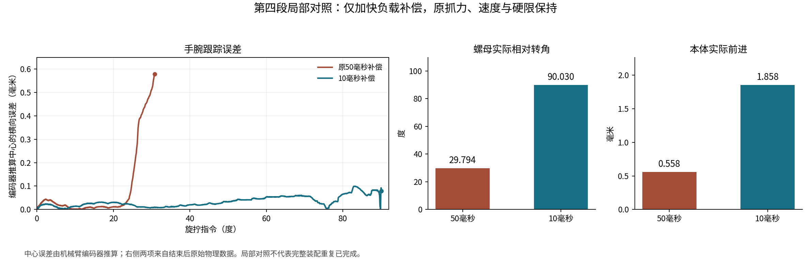

# 连接器装配：补偿修正、记录提速与重复验证

当前状态（2026-09-16）：保存版已上传，局部控制、记录和键槽对照已经完成；本分支准备开始完整重复。**尚不把局部结果写成完整装配重复成功。** 原完整14的机械装配与原2µm数值失败都保留。

## 已定位并实际改善的控制问题

负载补偿原来使用与导纳/停止判断相同的50毫秒平滑信号。在旋拧负载快速变化时，补偿存在滞后，手腕即使已收到向内纠偏指令，实际仍可能向外偏移。现在只给用于抵消外部负载的前馈补偿单独使用10毫秒信号；原50毫秒导纳/判断、抓力、旋拧速度和全部力/力矩硬限保持。

第四段使用同一起始状态的有效局部对照如下。两次都是明确的冷初始化诊断，没有恢复原生接触warm-start；它们不能替代完整视觉装配。

| 测量 | 原50毫秒 | 10毫秒 |
| --- | ---: | ---: |
| 最大编码器推算中心横向误差 | 0.579183mm | 0.099038mm |
| 手腕旋拧指令 | 30.802580°后正常换抓 | 90°完整结束 |
| 螺母实际相对本体转角 | 29.793825° | 90.029598° |
| 本体实际前进 | 0.557780mm | 1.857549mm |
| 硬停止/手部传动越界 | 无 | 无 |



独立只读审查确认两份实际配方只有负载补偿时间常数这一项有效差别，XY/Z限速均为2/3mm/s；默认None分支保留旧算式。报告与逐项比较保存在本分支`reproducibility/improvements_20260916/evidence/`。

## 记录提速的实际范围

接触路径的类别判断可复用，只缓存路径归属，不缓存接触数值。原生位置/法向/冲量向量改为拥有独立数值的不可修改元组，减少Python循环垃圾回收扫描；JSON/MessagePack保存的数组与数值保持。

实际481拍受载保持的整个解压MessagePack流（1421146150字节）逐字节相同。接触回调37.243→32.301秒，减少13.27%；物理、传感器和记录合计76.744→72.586秒，减少5.42%。这是一次短窗口结果，完整流程耗时仍需实测。没有关闭GC或减少采样、接触点及异常检查。

只需位姿的键槽后评不再构造无关接触点对象。新读取器重算原完整14的全部键槽结果，除本机模型路径外与原报告完全一致，原失败仍为失败，未覆盖原报告。机器人历史落盘原型未测到提速，因此未加入生产入口。

## 键槽原2µm标准保持

原完整14最小间隙−2.147659492µm。更高精度重算几乎不改变结果；保存本体位姿量化的保守影响约0.014934µm，不能单独解释0.147659µm超带。检查平面与当前槽壁三角面最大差别不足0.001µm。

局部时序核对显示，原生接触间隙更接近前一拍保存的位姿；对齐后两者差异约0.008µm，而不是把同一记录中的接触生成时刻和步后位姿混为同一时刻。原生下一拍约−2.156µm也支持原超带真实存在。该接触对使用凸包键和静态三角网格槽壁，没有使用SDF网格。

| 第二段局部对照 | 最大腕中心误差 | 五键最严重穿入 | 原2µm检查 |
| --- | ---: | ---: | --- |
| 50毫秒、64次位置求解 | 0.638477mm | 1.678369µm | 通过 |
| 10毫秒、64次位置求解 | 0.153325mm | 0.896779µm | 通过 |
| 10毫秒、128次位置求解 | 0.318629mm | 1.188415µm | 通过 |

这个局部初始化没有重现原全程2.148µm的最坏点，因此不能据局部通过宣布整场问题已消失。128次没有带来更好的局部结果，正式候选保留经验证的CPU960Hz、64位置/4速度迭代、原模型和材料；采用10毫秒补偿，在后续完整重复中逐拍核验2µm标准。

## 下载和运行本分支

```bash
git clone --branch codex/connector-assembly-improvements-20260916 https://github.com/dongtian12138/kcgtest1.git kcgtest1-improved
cd kcgtest1-improved
python3 scripts/prepare_assembly_reproduction.py --assets
python3 scripts/prepare_assembly_reproduction.py --sam6d --reuse-sam6d-cache /home/noob/.cache/kcgtest1-sam6d
source /opt/ros/humble/setup.bash
colcon build --packages-select iiwa_description --symlink-install
export ISAAC_ENV_PREFIX=/home/noob/WorkPlace/isaacsim/.conda-env
export KCG_PLANNER_PYTHON=/home/noob/WorkPlace/kcgtest1/.venv/bin/python
export KCG_SAM6D_PYTHON=/home/noob/.cache/kcgtest1-sam6d/.venv/bin/python
python3 scripts/run_current_hand_assembly.py --check
python3 scripts/run_current_hand_assembly.py --run --gui
```

无窗口录像用`--run`；每次先新预检，再完整动作，并创建新的结果目录。三个环境、SAM上游权重和保存版资产准备方式见[环境与保存版说明](REPRODUCE_CURRENT_HAND_ASSEMBLY_CN.md)。跨机器从零安装环境尚未验证，GUI完整重跑也尚未验证。默认命令明确绑定本分支的`load10ms_native_lossless_tuple_cpu960_64_4`配方。

原保存版：[分支](https://github.com/dongtian12138/kcgtest1/tree/codex/connector-assembly-baseline-20260916)；[资产与原完整视频](https://github.com/dongtian12138/kcgtest1/releases/tag/assembly-baseline-20260916)。原成功版不因本分支的改动而丢失。

## 尚需完成的验收

先两次相同初始场景的完整视觉装配，再做一个小范围位置/角度扰动回合。每次独立核对本体到位、最终张手后实际无手接触、原止挡与簧套承载、源指甲/指腹、五键2µm标准，以及完整视频；退出码或控制器completed不能代替物理验收。

本轮两次误选前段参数的早期局部尝试，以及一次旧资产路径身份检查失败都保留在本机原始记录中，不进入有效A/B比较。有效matched配方已经在启动前和运行后交叉核对。

仅仿真，hardware_authorized=false。
